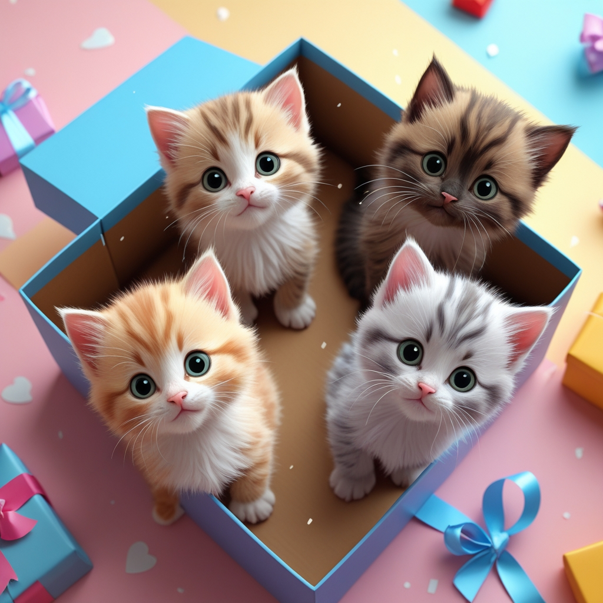

-------

# Projeto EBOOK Gerado por I.A.s

 > ℹ️ **NOTE:** Este é o repositório desenvolvido durante o curso no qual fui instrutor técnico na plataforma da [DIO](https://dio.me)

Projeto com o objetivo de gerar um ebook digital com as facilidades das ferramentas de IA. todos os prompts
seguem abaixo.

<a href="https://github.com/Thaeliza/prompts-recipe-to-create-a-ebook/blob/main/output/ebook_dio.pdf" title="View PDF now"> 📕Clique aqui para ler</a>

## 💻 Tecnologias utilizadas no projeto

- [ChatGPT](https://chat.openai.com/) 
- [Leonardo.AI](https://app.leonardo.ai/image-generation)
- [PowerPoint](https://www.microsoft.com/en/microsoft-365/powerpoint)

## 🧠 Prompts

ChatGPT：

|   Ação   | prompt                                                                                                                                                                                                                                                                         |
| :------: | ------------------------------------------------------------------------------------------------------------------------------------------------------------------------------------------------------------------------------------------------------------------------------ |
|  título  | Crie um título de um ebook sobre o tema "Adoção de Gatos". O ebook é para o público em geral, o título deve ser curto e direto. Liste ao menos cinco opções de títulos.
| conteúdo | Atue como um redator de texto para um ebook sobre adoção de gatos e formule os principais tópicos que deverão ser abordados como dicas para adoção de gatos. {REGRAS} Explique sempre de uma maneira simples e direta, utilizando uma linguagem mais acessível para o público em geral. 

Leonardo.Ai：

|  Ação  | prompt                                                                                 |
| :----: | -------------------------------------------------------------------------------------- |
| título | Create a cartoon scene, in bird´s eye view, of a present box opened with four cute little kittens, with different fur, eye and nose colors from each other. The background image is colorful, but in light pastel colors. With elements that refer to the love between humans and animals. |

## ✨ Features

- Conteúdo gerado via ChatGPT
- Imagens geradas via Leonardo.Ai

## 📚 Materiais

- Imagens utilizadas em `assets`
- ebook gerado durante as aulas em `output`

## 🛠️ Instruções de execução

Utilize os prompts acima nas ferramentas sugeridas para gerar o material base e utilize uma ferramenta de edição de documentos como power point, libreoffice , indesign para diagramação.

## 👨‍💻 Aprendiz

 por [Eliza](https://github.com/Thaeliza)
